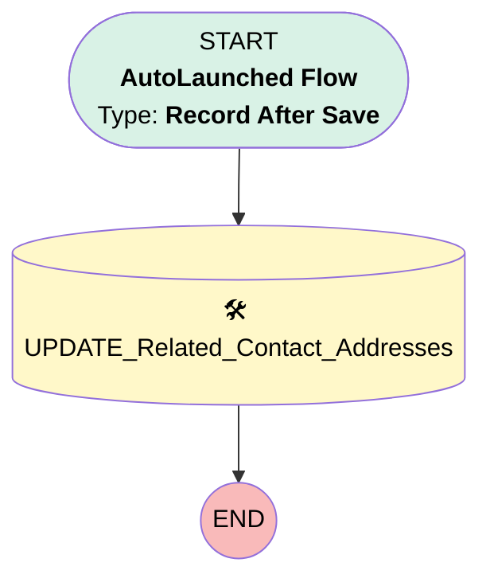

# Account_AU_UpdateContactAddresses

## Flow Diagram

<!-- Flow description -->

## General Information

|<!-- -->|<!-- -->|
|:---|:---|
|Object|Account|
|Process Type| Auto Launched Flow|
|Trigger Type| Record After Save|
|Record Trigger Type| Update|
|Label|Account_AU_UpdateContactAddresses|
|Status|Active|
|Description|Update the Contact Addresses to match the business address|
|Environments|Default|
|Interview Label|Account_AU_UpdateContactAddresses {!$Flow.CurrentDateTime}|
| Builder Type (PM)|LightningFlowBuilder|
| Canvas Mode (PM)|AUTO_LAYOUT_CANVAS|
| Origin Builder Type (PM)|LightningFlowBuilder|
|Connector|[UPDATE_Related_Contact_Addresses](#update_related_contact_addresses)|
|Next Node|[UPDATE_Related_Contact_Addresses](#update_related_contact_addresses)|

## Flow Nodes Details

### UPDATE_Related_Contact_Addresses

|<!-- -->|<!-- -->|
|:---|:---|
|Type|Record Update|
|Label|[UPDATE_Related_Contact_Addresses](#update_related_contact_addresses)|
|Description|update Acct Shipping Address to Contact Mailing Address|
|Input Reference|$Record.Contacts|

#### Input Assignments

|Field|Value|
|:-- |:--: |
|MailingCity|$Record.ShippingCity|
|MailingCountry|$Record.ShippingCountry|
|MailingPostalCode|$Record.ShippingPostalCode|
|MailingState|$Record.ShippingState|
|MailingStreet|$Record.ShippingStreet|

___

_Documentation generated from branch main by [sfdx-hardis](https://sfdx-hardis.cloudity.com), featuring [salesforce-flow-visualiser](https://github.com/toddhalfpenny/salesforce-flow-visualiser)_