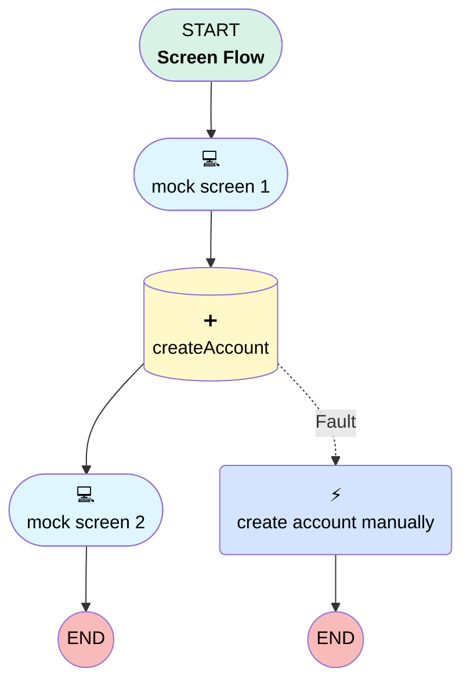

# Duplicate DML Operation

## Flow Diagram

<!-- Flow description -->

## General Information

|<!-- -->|<!-- -->|
|:---|:---|
|Process Type| Flow|
|Label|Duplicate DML Operation|
|Status|Active|
|Description|This flow demonstrates a violation of the rule "Duplicate DML Operation".|
|Environments|Default|
|Interview Label|Duplicate DML Operation {!$Flow.CurrentDateTime}|
| Builder Type (PM)|LightningFlowBuilder|
| Canvas Mode (PM)|AUTO_LAYOUT_CANVAS|
| Origin Builder Type (PM)|LightningFlowBuilder|
|Connector|[mock_screen_1](#mock_screen_1)|
|Next Node|[mock_screen_1](#mock_screen_1)|

## Variables

|Name|Data Type|Is Collection|Is Input|Is Output|Object Type|Description|
|:-- |:--:|:--:|:--:|:--:|:--:|:--  |
|Account|SObject|⬜|⬜|⬜|Account|<!-- -->|

## Flow Nodes Details

### create_account_manually

|<!-- -->|<!-- -->|
|:---|:---|
|Type|Action Call|
|Label|create account manually|
|Action Type|Quick Action|
|Action Name|FeedItem.NewTaskFromFeedItem|
|Flow Transaction Model|CurrentTransaction|
|Name Segment|FeedItem.NewTaskFromFeedItem|
|Version Segment|1|
|Context Id (input)|$User.Id|

### createAccount

|<!-- -->|<!-- -->|
|:---|:---|
|Type|Record Create|
|Object|Account|
|Label|[createAccount](#createaccount)|
|Fault Connector|[create_account_manually](#create_account_manually)|
|Store Output Automatically|✅|
|Connector|[mock_screen_2](#mock_screen_2)|

#### Input Assignments

|Field|Value|
|:-- |:--: |
|Name|account_name|

### mock_screen_1

|<!-- -->|<!-- -->|
|:---|:---|
|Type|Screen|
|Label|mock screen 1|
|Allow Back|✅|
|Allow Finish|✅|
|Allow Pause|✅|
|Show Footer|✅|
|Show Header|✅|
|Connector|[createAccount](#createaccount)|

#### account_name

|<!-- -->|<!-- -->|
|:---|:---|
|Data Type|String|
|Field Text|account name|
|Field Type| Input Field|
|Is Required|⬜|

### mock_screen_2

|<!-- -->|<!-- -->|
|:---|:---|
|Type|Screen|
|Label|mock screen 2|
|Allow Back|✅|
|Allow Finish|✅|
|Allow Pause|✅|
|Show Footer|✅|
|Show Header|✅|

___

_Documentation generated from branch main by [sfdx-hardis](https://sfdx-hardis.cloudity.com), featuring [salesforce-flow-visualiser](https://github.com/toddhalfpenny/salesforce-flow-visualiser)_